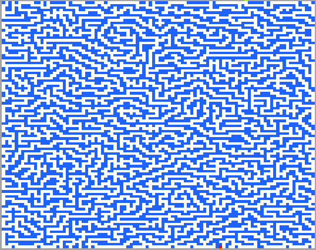

# Maze Solver

## Project Description

This MATLAB program is applied to **generate a maze** applying DFS. Then solve it using different metheds, including: ***A star***, ***DFS*** and ***Greedy***.

----

## Project Structure

```
Maze Solver
│
├── report
│
├── Astar-MazeSolver
│   |── AStarMazeSolver.m
│   ├── AStarStart.m
│   └── AStar.mat
│
├── DFS-MazeSolver
│   |── DFSMazeSolver.m
│   ├── DFSStart.m
│   └── DSF.mat
│
├── Greedy-MazeSolver
│   |── GreedyMazeSolver.m
│   ├── GreedyStart.m
│   └── Greedy.mat
│
└── MazeGenerator
    ├── adjustEnd.m
    ├── checkNode.m
    ├── dispMaze.m
    ├── main.m
    ├── move.m
    ├── point.m
    ├── setup.m
    └── validateMove.m

```

----

## Maze Generator

By executing the <code>main.m</code> program, a window will pop out to ask user to input the size and difficulty of the resulting maze.

The maze is generated by a DFS method:

1. The path is created through DFS and once it hits the boundaries or existing paths, the program will jump back to the last turning point and generate a diversion.

2. After the path is reached the top boundary, the exit (in green) will try to reach the path by drilling straightly downwards.

3. Finally, the program will try to create diversion in each turning point within the path to fill up all the blank space.

A sample is demonstrated below:


----

## Astar Maze Solver

This program will solve the maze by apply Astar searching method (Could be slow by searching all possibilities exhausively).

A sample is demonstrated below:



----

## DFS Maze Solver

This program will solve the maze by apply DFS searching method.

A sample is demonstrated below:


----

## Greedy Maze Solver

This program will solve the maze by apply Greedy searching method

A sample is demonstrated below:

